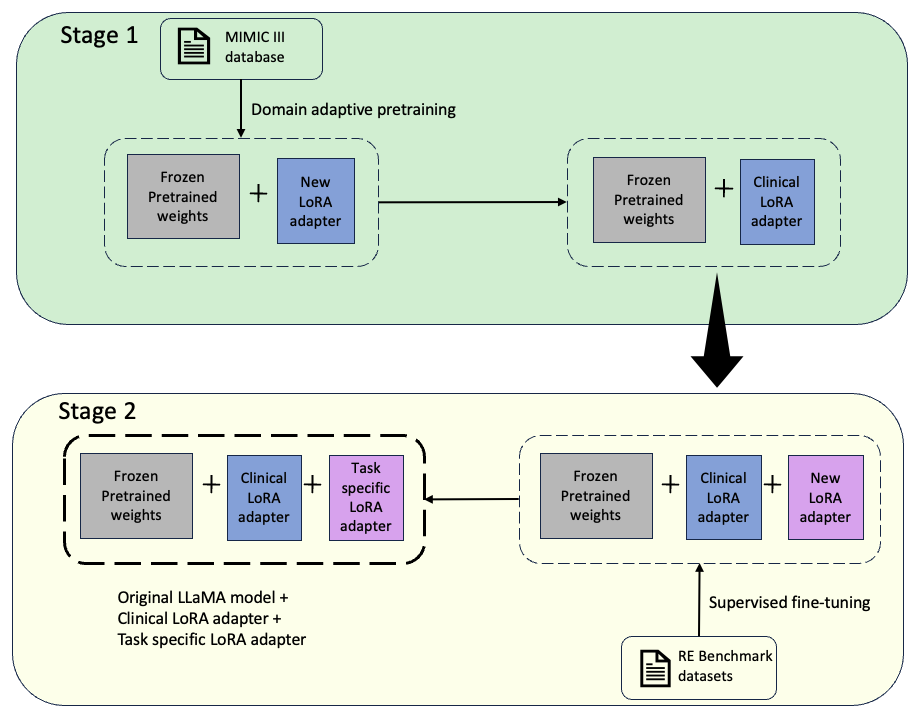

# A Unified Framework for Clinical Relation Extraction

### Introduction

The work presents the development of a Clinical Relation Extraction framework
built upon Large Language Models (LLMs). The primary objective of this work
is to harness the exceptional capabilities of LLMs, specifically the foundational
language model known as LLaMA, for effective clinical domain tasks. The project
comprises a two-stage approach, beginning with the adaptation of LLaMA to
the clinical domain. The resulting clinical LLaMA models are further fine-tuned
on predetermined evaluation benchmark datasets in a supervised setting. Our
training methodologies use a parameter-efficient fine-tuning technique called
Low-Rank Adaptation. The comprehensive evaluation and analysis conducted on
both clinical and biomedical benchmark datasets helped us highlight the strengths
and limitations of our clinical LLaMA models.


### Our Framework




## Code structure

The code directory is structured as follows:
```
LLamaClincialRE/
├── datasets/
│   ├── euadr/
│   ├── GAD/
│   ├── i2b2_2010/   
│   └── n2c2_2018/ 
├── notebooks/
├── scripts/
├── models/
├── src/
│   ├── data/
│   └── models/
├── visualisation/
├── requirements/
├── .gitignore
|── app.log
├── final_report.pdf
└── README.md
```

## Datasets

Pretraining datasets used in this project are as follows:
- MIMIC-III: https://physionet.org/content/mimiciii/1.4/

The evaluation datasets used in this project are as follows:
- Clincial datasets: i2b2 2010 and n2c2 2018. Due to usage agreements, we have not shared the datasets; please use https://portal.dbmi.hms.harvard.edu/projects/n2c2-nlp/ to gain access to the datasets.
- Biomedical datasets: GAD and EUADR. The datasets are available in the datasets folder (preprocessed versions from https://github.com/dmis-lab/biobert ).

## Models

The base models used in this project are LLaMA 1 and LLaMA 2.

## Set up and Installation

### 1. Clone the repository

```bash
git clone https://github.com/Lathashree01/LlamaClinicalRE.git
cd LlamaClinicalRE
```

### 2. Install the requirements

Create a virtual environment to install the requirements.

The requirements are divided into two environments:
- clm_requirements.txt: Requirements for the DAP of LLaMA models
- finetuneenv_requirements.txt: Requirements for fine-tuning the original or Clinical LLaMA models 

Example:

Creating a virtual environment for DAP of LLaMA models
```bash
mkdir clmenv
python3 -m venv clmenv
source clmenv/bin/activate
```

Installing the requirements
```bash
cd requirements
pip install -r clm_requirements.txt
```

### 3. Download the models
Please acquire access to LLaMA 1 from the official meta website by filling out the request form or LLaMA2 models from https://huggingface.co/meta-llama

### 4. Running the DAP

Change the model paths in the src/models/run_pt.sh file 

```bash
sh src/models/run_pt.sh
```

### 5. Running the Supervised Fine-tuning

```bash
python src/models/run_ft_benchmarks.py --model_type llama1 --PATH_TO_ORIGINAL_WEIGHTS /path_to_base_model/ --PEFT_PATH /peft_model_path/ --mycache_dir cachedir
```
Command line args:

- model_type: llama1 or llama2 or llama1_pre or llama2_pre
- PATH_TO_ORIGINAL_WEIGHTS: Path to the base model (llama models need to be downloaded beforehand)
- PEFT_PATH: Path to the peft model (Needed in case of fine-tuning Clinical LLAMA models)
- mycache_dir: Path to the cache directory (Needed as llama2 is gated model, else huggingface cache will be used or tries to download from huggingface)

**Please note:** Refer https://github.com/Lathashree01/ClinicalRE_n2c2 for fine-tuning the LLaMA models on n2c2 2018 dataset.
### Results

Please refer to Chapter 4 of the final report for the results.


## Acknowledgements

This project is based on the following open-source projects for further development.

- https://github.com/ymcui/Chinese-LLaMA-Alpaca/
- https://github.com/uf-hobi-informatics-lab/NLPreprocessing
- https://github.com/uf-hobi-informatics-lab/ClinicalTransformerRelationExtraction
- https://github.com/hushee69/biobert-relation-extraction


## Main libraries used
- https://github.com/huggingface/transformers
- https://github.com/huggingface/peft
- https://github.com/huggingface/accelerate


## Contact

For any queries, please open a GitHub issue.
